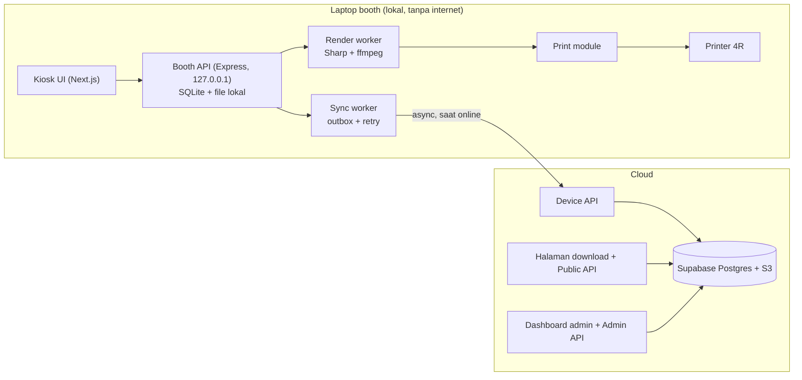

# 03. Arsitektur, Stack, dan Struktur Direktori

## Diagram



Booth tidak pernah menunggu cloud: semua langkah tamu selesai di laptop, lalu Sync worker mengirim sesi dan file ke cloud saat internet ada. Hasil mengalir naik (booth ke cloud), config mengalir turun (admin ke cloud ke booth).

## Keputusan arsitektur

- **Local-first, cloud async.** Booth API (Express, hanya di 127.0.0.1) menjadi sumber kebenaran sesi selama booth berjalan, dengan SQLite dan folder file lokal. Cloud adalah tujuan sinkron, bukan syarat operasi.
- **Pemisahan URL dan permukaan API.** Kiosk dan Booth API hanya lokal, jadi tidak ada endpoint publik untuk membuat sesi. Cloud punya tiga permukaan terpisah: Public API (read-only untuk halaman download), Device API (khusus booth), dan Admin API (khusus admin).
- **Render di worker lokal** (Sharp dan ffmpeg) agar print dan QR tidak bergantung internet. Spesifikasi laptop awal yang disarankan: CPU 4 core, RAM 8 GB, SSD, dibuktikan lewat uji beban di M3.
- **Antrean di database** tanpa Redis di v1: `outbox`, `render_jobs`, dan `print_jobs` di SQLite lokal.
- **Upload ke S3** memakai presigned URL multipart dari Device API, dijalankan Sync worker (Node di laptop).
- **Supabase** untuk Postgres dan Auth. Supabase Storage tidak dipakai, file ke S3.
- **Config mengalir turun:** admin mengubah config di cloud, booth menariknya saat start dan tiap 60 detik saat online, menyimpannya di cache lokal, dan menerapkannya mulai sesi berikutnya. Versi aplikasi booth dikirim lewat heartbeat.

## Host dan akses

Host dan akses dipisah menurut penggunanya, dan tiap host punya middleware, CORS, dan rate limit sendiri.

| Host (contoh) | Isi | Akses |
|---|---|---|
| `localhost` (laptop booth) | Kiosk UI + Booth API | Hanya laptop booth; Booth API bind ke 127.0.0.1 |
| `domain.com/download/[code]` | Halaman download + Public API | Publik tanpa login, read-only, rate limit per IP |
| `admin.domain.com` | Dashboard admin | Login + MFA, role admin |
| `api-admin.domain.com` | Admin API | JWT admin, CORS hanya `admin.domain.com`, opsional IP allowlist |
| `device.domain.com` | Device API (sinkron, config, heartbeat, perintah) | Device key booth, bukan browser, rate limit per device |

## Sinkronisasi async

Pola outbox: setiap perubahan penting di Booth API ditulis ke tabel `outbox` dalam transaksi yang sama, lalu Sync worker mengirimnya ke cloud dengan urutan prioritas.

1. Metadata sesi dan `public_code` (kecil, agar kode QR segera dikenal cloud).
2. Hasil akhir berurutan: strip, GIF, live photo H.264, lalu H.265.
3. Foto dan klip mentah (opsional, diatur admin; dibutuhkan untuk cetak ulang dari dashboard).
4. Log, statistik, dan heartbeat.

Aturan:

- Semua operasi idempotent: sesi dikenali lewat UUID buatan lokal dan file lewat kunci S3 deterministik, jadi retry aman. Retry memakai exponential backoff dan upload multipart bisa dilanjutkan.
- Tidak ada konflik tulis: booth satu-satunya penulis data sesi, cloud satu-satunya penulis config dan frame.
- Status sinkron sesi (`pending`, `syncing`, `synced`, `failed`) terpisah dari status alur sesi. Setelah semua file terkonfirmasi di S3, cloud menandai halaman download siap dan membuat ZIP.
- File lokal dihapus setelah `synced` plus masa simpan lokal (default 7 hari), atau lebih awal bila disk di bawah batas.
- Risiko laptop rusak sebelum sinkron dimitigasi lewat prioritas kirim (metadata dan hasil akhir lebih dulu), alert dashboard untuk antrean tertua, dan pre-flight disk.

## Stack

| Lapisan | Pilihan |
|---|---|
| Frontend kiosk, admin, download | Next.js (App Router), TypeScript, Tailwind CSS, Zustand (state alur kiosk), TanStack Query |
| Kamera | `getUserMedia`, `MediaRecorder` (klip per slot), Canvas API |
| UI admin | shadcn/ui, Recharts, TanStack Table, editor slot berbasis canvas/SVG |
| Backend cloud | Node.js + Express, TypeScript, Zod, Pino; router Public, Device, Admin terpisah |
| Booth API lokal | Express + better-sqlite3 (SQLite), Zod, Pino, node-cron untuk job pembersih |
| Database cloud | Supabase Postgres, Supabase Auth |
| Storage | AWS S3 (atau kompatibel: Cloudflare R2, MinIO), presigned URL multipart |
| Render media | Sharp (komposit dan deteksi green screen), ffmpeg (fluent-ffmpeg), gifenc |
| QR | `qrcode` |
| Printer | `pdf-to-printer` / `lp` (CUPS), modul di Booth API |
| Tooling | pnpm workspaces, Turborepo, ESLint, Prettier, Vitest, Playwright, Docker (cloud) |

## Struktur direktori (monorepo)

```
photobooth/
├─ AGENTS.md
├─ DESIGN.md
├─ apps/
│  ├─ kiosk/                    # Next.js, jalan lokal di laptop booth
│  │  ├─ src/app/
│  │  │  ├─ page.tsx            # Home (attract mode)
│  │  │  ├─ frame/page.tsx
│  │  │  ├─ action/page.tsx
│  │  │  ├─ preview/page.tsx
│  │  │  ├─ processing/page.tsx
│  │  │  ├─ result/page.tsx
│  │  │  ├─ closing/page.tsx
│  │  │  └─ operator/page.tsx   # panel status + PIN
│  │  ├─ src/components/        # FrameStage, CameraView, Countdown, ReminderModal
│  │  ├─ src/hooks/             # useCamera, useClipRecorder, useStageTimer
│  │  ├─ src/stores/            # kioskStore.ts
│  │  └─ src/lib/               # boothApi client, util layering
│  ├─ booth-api/                # Express lokal (127.0.0.1), SQLite, file lokal
│  │  ├─ src/routes/            # sessions, frames, capture, outputs, print, status, operator
│  │  ├─ src/services/          # session, render, print, preflight, sync
│  │  ├─ src/workers/           # renderStrip, renderGif, renderLive, syncWorker, cleanup
│  │  ├─ src/db/                # skema SQLite + migrasi
│  │  └─ src/server.ts
│  ├─ download/                 # Next.js publik (domain.com/download/[code])
│  │  └─ src/app/download/[code]/page.tsx
│  ├─ admin/                    # Next.js dashboard (admin.domain.com)
│  │  ├─ src/app/(auth)/login/
│  │  ├─ src/app/(dash)/        # overview, sessions, revenue, frames, pricing, output,
│  │  │                         # timers, camera, printer, health, logs, settings
│  │  ├─ src/components/frame-editor/   # deteksi slot, editor visual, preview
│  │  └─ middleware.ts
│  └─ cloud-api/                # Express cloud, tiga router terpisah
│     ├─ src/public/            # GET download (read-only)
│     ├─ src/device/            # config, sync, presign, heartbeat, commands
│     ├─ src/admin/             # CRUD, stats, frame analyze, logs
│     ├─ src/middlewares/       # authAdmin, authDevice, rateLimit, error
│     └─ src/server.ts
├─ packages/
│  ├─ shared/                   # tipe TS, skema Zod, konstanta status, util layout
│  ├─ frame-engine/             # deteksi green screen, keying, urutan layer render
│  └─ config/                   # tsconfig, eslint
├─ supabase/migrations/         # skema Postgres + RLS
├─ docs/                        # dokumen ini
├─ docker-compose.yml           # cloud-api untuk dev
├─ .env.example
└─ turbo.json · pnpm-workspace.yaml
```

`packages/frame-engine` dipakai bersama: `cloud-api` (endpoint analisis frame) dan `booth-api` (render), supaya deteksi dan komposit konsisten.
